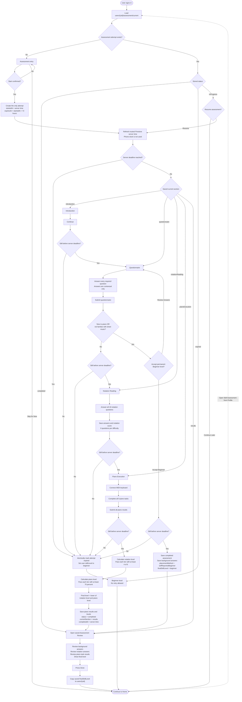

```mermaid
flowchart TD
    A([User signs in]) --> B["Load users/{uid}/assessment/current"]
    B --> C{Assessment attempt exists?}

    C -- No --> D[Assessment entry]
    D --> E{Start confirmed?}
    D -- Skip for Now --> HOME
    E -- No --> D
    E -- Yes --> F["Create the only attempt<br/>startedAt = server time<br/>expiresAt = startedAt + 72 hours"]

    C -- Yes --> G{Stored status}
    G -- completed --> R[Open saved Assessment Review]
    G -- expired --> X["Beginner level<br/>No retry allowed"]
    G -- inProgress --> G1{Resume assessment?}
    G1 -- Continue Later --> HOME
    G1 -- Resume --> H["Refresh trusted Firestore server time<br/>Phone clock is not used"]
    F --> H

    H --> I{Server deadline reached?}
    I -- Yes --> J["Atomically mark attempt expired<br/>Set user skillLevel to beginner"]
    J --> X
    I -- No --> K{Saved current section}

    K -- introduction --> L[Introduction]
    K -- questionnaire --> M[Questionnaire]
    K -- notationReading --> N[Notation Reading]
    K -- pianoExecution --> P[Piano Execution]
    K -- results --> R

    L --> L1[Continue]
    L1 --> T1{Still before server deadline?}
    T1 -- No --> J
    T1 -- Yes --> M

    M --> M1["Answer every required question<br/>Answers are contextual only"]
    M1 --> M2[Submit questionnaire]
    M2 --> M3{"New to piano OR<br/>not familiar with sheet music?"}
    M3 -- No --> T2{Still before server deadline?}
    M3 -- Yes --> M4{Accept permanent Beginner level?}
    M4 -- Review Answers --> M
    M4 -- Accept Beginner --> T2B{Still before server deadline?}
    T2B -- No --> J
    T2B -- Yes --> M5["Save completed assessment<br/>Save background answers<br/>placementMethod = selfReportedBeginner<br/>finalSkillLevel = beginner"]
    M5 --> R
    T2 -- No --> J
    T2 -- Yes --> N

    N --> N1[Answer all 18 notation questions]
    N1 --> N2["Save answers and notation score<br/>6 questions per difficulty"]
    N2 --> T3{Still before server deadline?}
    T3 -- No --> J
    T3 -- Yes --> P

    P --> P1[Connect MIDI keyboard]
    P1 --> P2[Complete all 9 piano tasks]
    P2 --> P3[Submit all piano results]
    P3 --> T4{Still before server deadline?}
    T4 -- No --> J
    T4 -- Yes --> S1["Calculate notation level<br/>Pass each tier with at least 4 of 6"]

    S1 --> S2["Calculate piano level<br/>Pass each tier with at least 70 percent"]
    S2 --> S3["Final level = lower of<br/>notation level and piano level"]
    S3 --> S4["Save piano results and levels<br/>status = completed<br/>currentSection = results<br/>completedAt = server time"]
    S4 --> R

    R --> R1["Review background answers<br/>Review notation answers<br/>Review piano task results<br/>Show final level"]
    R1 --> R2[Press Done]
    R2 --> R3["Copy saved finalSkillLevel<br/>to users/{uid}"]
    R3 --> HOME([Continue to Home])
    X --> HOME
    HOME -. Open Skill Assessment from Profile .-> B
```
